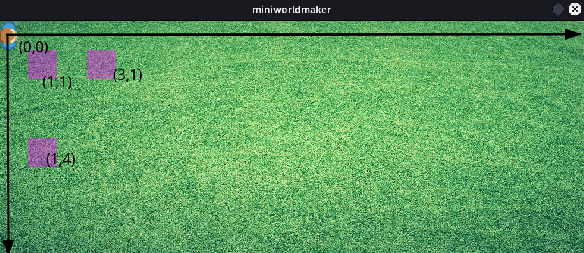
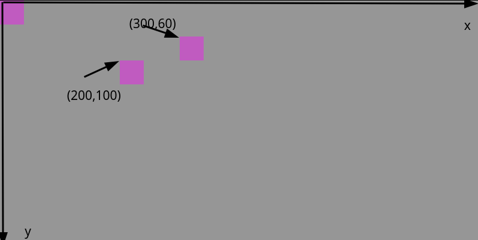
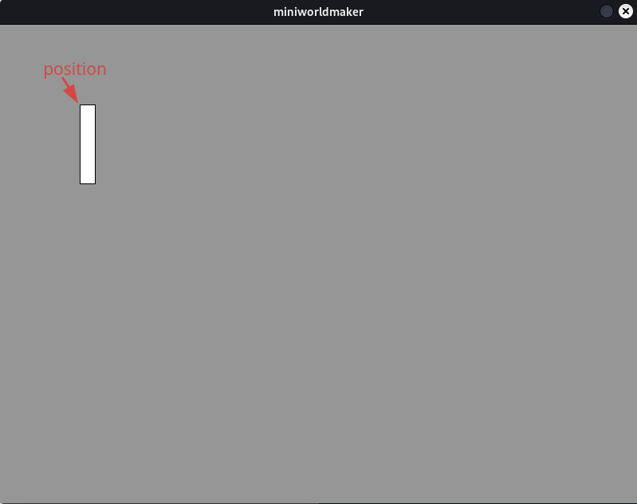

# Tokens

## Was sind Tokens?

Ein **Token** ist ein Spielstein auf deinem Board.

Alle Objekte auf deinem Board sind `Tokens`, die auf dem ``Board`` bewegt
werden können und die miteinander kommunizieren können.

## Beispiel: Ein Token erstellen

Nachdem du das `Board` erstellt hast, wird nun ein `Token`, *(d.h. eine
Spielfigur)* auf dem Board platziert. Dies geht so:

``` {code-block} python
---
lineno-start: 1
---
from miniworldmaker import *
board = TiledBoard()
board.columns = 20
board.rows = 8
board.tile_size = 42
board.add_background("images/soccer_green.jpg")
player = Token()

board.run()
```

Was passiert hier?

In Zeile 7 wird ein `player` Objekt erstellt. Das Token wird in der oberen linken Ecke hinzugefügt. 
Zunächst wird das Token als violettes Rechteck angezeigt, da es weder eine Farbe noch einen Hintergrund hat.

Ausgabe:


## Kostüme

Jedes `Token` hat ein `Costume`.
Damit deine Tokens unterschiedlich aussehen, kannst du deinem Token ein
Kostüm *anziehen*.


### Beispiele

#### Ein neues Kostüm hinzufügen

Ein neues Kostüm kannst du mit folgendem Befehl hinzufügen.

``` python
token_name.add_costume("path_to_image")
```

```{note}
Hinweis: `path_to_image` ist ein (relativer Pfad) zum Bild. 

Du solltest deine Bilder in dem Unterordner `images` ablgegen. Auf Das Bild
`my_image.png` in dem Unterordner `images` kannst du mit dem Pfad `images/my_image.png` zugreifen.
```

### Erstes Beispiel

Wir fügen im Beispiel von oben ein Kostüm hinzu:


``` python
from miniworldmaker import *

board = TiledBoard()
board.columns = 20
board.rows = 8
board.tile_size = 42
board.add_background("images/soccer_green.jpg")
board.speed = 30
player = Token()
player.add_costume("images/player.png")

board.run()
```

Ausgabe:


### Beispiel: Mehrere Kostüme

Hier werden vier Tokens angelegt, die alle unterschiedliche Kostüme haben:

``` python
import miniworldmaker

board = miniworldmaker.TiledBoard()
board.columns = 5
board.rows = 4
board.add_background("images/soccer_green.jpg")

t1 = miniworldmaker.Token((0,1))
t1.add_costume("images/cow.png")

t2 = miniworldmaker.Token((1,1))
t2.add_costume("images/chicken.png")

t3 = miniworldmaker.Token((2,1))
t3.add_costume("images/dog.png")

t4 = miniworldmaker.Token((3,1))
t4.add_costume("images/goat.png")

board.run()
```

Ausgabe:


### FAQ zu Kostümen

-   Mein Token ist **falsch ausgerichtet**, was soll ich tun?

    Ein Token ist dann korrekt ausgerichtet, wenn das Bild nach oben
    guckt. Wenn das Bild per Default in eine andere Richtung
    ausgerichtet ist, dann hast du zwei Möglichkeiten

-   Du kannst das Bild mit einem Bildeditor drehen

-   Du kannst in Miniworldmaker die Orientierung des Kostüms ändern.
    Dies geht mit `my_token.costume.orientation = 90` Setze für
    orientation den passenden Wert, damit das Kostüm korrekt
    ausgerichtet ist.

-   Manchmal ist es auch nötig, einzustellen, dass sich zwar das Token
    drehen kann, das Kostüm aber immer gleich ausgerichtet sein soll.
    Dies geht mit `my_token.costume.is_rotatable = False`.

## Die Position

Das Token wurde in der oberen linken Ecke erstellt. Wenn du das Token an einer beliebigen Stelle erstellen willst, dann musst du beim Aufrufen eine Position übergeben.

Der miniworldmaker verwendet dazu ein Koordinatensystem, die obere Linke Ecke ist die Position (0,0):

### Position auf einem TiledBoard

Auf einem TiledBoard kann auf die Kacheln direkt mit Koordinaten zugegriffen werden. Die Koordinate (2,1) bezeichnet also die Kachel die man erreicht, wenn man von links oben 2 Kacheln rechts und 1 Kachel nach unten wandert. 

Tokens haben hier immer die Größe einer Kachel.



### Position auf einem PixelBoard

Auf einem PixelBoard bezeichnet die ``position`` die x und y-Koordinate, die du am Bildschirm ablesen kannst. Als ``position`` eines Tokens wird immer die obere linke Ecke des Tokens bezeichnet.



## Beispiele

Im Beispiel oben kannst du folgendermaßen die Position ändern:

```
from miniworldmaker import *

board = TiledBoard()
board.columns = 20
board.rows = 8
board.tile_size = 42
board.add_background("images/soccer_green.jpg")
board.speed = 30
player = Token()
player.add_costume("images/player.png")
player.position = (3,4)
board.run()
```

Ausgabe:


## Arten von Tokens

Es gibt einige spezielle Tokens, die du verwenden kannst:

### Shapes

Es gibt verschiedene Shapes, z.B. `Rectangle`, `Line`, `Circle`, `Ellipse` mit denen du geometrische Objekte zeichnen kannst. Diese Objekte benötigen kein Kostüm.

``` {warning}
Geometrische Objekte können z.Z. nur auf einem `PixelBoard`, nicht auf einem `TiledBoard` gezeichnet werden.
```

#### Beispiel:

Zeichnen eines Kreises mit Hilfe der Position und des Radius:

``` python
import miniworldmaker
board = miniworldmaker.PixelBoard(80, 60)
miniworldmaker.Circle((40,30), 20)
board.run()
```


Folgende geometrische Objekte kannst du verwenden:

### Linien

Die Syntax zum Zeichnen einer Linie sieht folgendermaßen aus:

``` python
  Line(startpoint, endpoint)
```

Die Parameter `startpoint` und `endpoint` sind jeweils Tupel, z.B. (1, 2) für x=1 und y=2.

Wenn du eine Linie von (10,10) zu (100, 200) zeichnen willst so musst du z.B. folgendes schreiben:

``` python
from miniworldmaker import *

board = PixelBoard(800, 600)
Line((10,10), (100, 200))
board.run()
```

### Kreise

Kreise kannst du allgemein folgendermaßen erstellen:

``` python
  Line(position, radius)
```

Die Position ist der Mittelpunkt des Kreises.

Wenn du einen Kreis an der Stelle (400,300) mit Radius 20 erstellen willst, musst du folgendes schreiben:


``` python
from miniworldmaker import *

board = PixelBoard(800, 600)
Circle((400,300), 20)
board.run()
```

### Rechteck

Ein Rechteck wird beschrieben durch Position, Breite und Höhe:

``` python
Rectangle(position, width, height)
```

Der Parameter `position` beschreibt die obere linke Ecke des Rechtecks.

Willst du ein Rechteck an der Position (100, 100) mit Breite 20 und Höhe 100 zeichnen, so musst du folgendes schreiben:

``` python
code-block:: python
from miniworldmaker import *

board = PixelBoard(800, 600)
Rectangle((100, 100), 20, 100)
board.run()
```



### Ellipse

Ellipsen werden im Prinzip wie Rechtecke beschrieben, d.h. die Ellipse wird dann so gezeichnet, dass sie genau in das Rechteck hineinpasst. `width` und `height` beziehen sich hier jeweils auf den Durchmesser der Ellipse

``` python 
Ellipse(position, width, height)
```

Willst du eine Ellipse an der Position (100, 100) mit Breite 20 und Höhe 100 zeichnen, so musst du folgendes schreiben:

``` python
from miniworldmaker import *

board = PixelBoard(800, 600)
Rectangle((100, 100), 20, 100)
board.run()
```

## Ausblick

-   Mehr Informationen. Siehe
    [Key Concepts: Boards](../key_concepts/tokens)