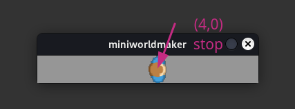

# Fachkonzept: if-then Verzeigungen

## if-Anweisung

Die if Anweisung hat folgende Form:

```python
if condition:
    codeblock
```

``condition`` kann dabei eine beliebige Bedingung sein (z.B. `a < 3`), welche von Python überprüft werden kann.

``codeblock`` ist ein Codeblock, bei dem jede Zeile gleichweit eingerückt ist. Auf diese Weise kann unterschieden werden.

Wenn die Bedingung erfüllt ist, dann wird nacheinander der komplette Codeblock ausgeführt.

### Beispiel

Das folgende Beispiel bewegt den ``player`` bis zum Feld `(0,4)`, dort stoppt er.

```python
from miniworldmaker import *

board = TiledBoard()
board.columns = 8
board.rows = 1
board.speed = 30
player = Token()
player.add_costume("images/player_1.png")

@player.register
def act(self):
    print(player.position)
    if player.position != (4,0):
        player.direction = "right"
        player.move()
    
    

board.run()
```

