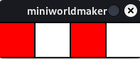
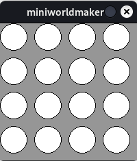

# Konzept: Schleifen

## Die for-Schleife

Die for-schleife wiederholt -vereinfacht gesprochen- einen Befehl n-mal:

### Beispiel

Die folgende Schleife wird 5-mal durchlaufen:

``` python
for i in range(5):
    print("I'm in a loop!")
```

Das Programm gibt folgende Ausgabe
```
I'm in a loop!
I'm in a loop!
I'm in a loop!
I'm in a loop!
I'm in a loop!
```

## Die Zählervariable

Man kann die Variable i als Zählervariable verwenden. Sie zählt (von 0 beginnend) hoch:

### Beispiel

``` python
for i in range(5):
    print(i)
```

Das Programm gibt folgende Ausgabe
```
0
1
2
3
4
```

## Allgemeine Form:

Allgemein schreibt man:

``` python
for i in range(max):
    <codeblock>
```

oder

``` python
for i in range(min, max):
    <codeblock>
```

Man kann jeweils angeben wie oft die Schleife durchlaufen wird oder bestimmte Bereiche angeben:

### Beispiele: Mit Schleifen zeichnen

Mit Schleifen kann man zeichnen:

``` python
from miniworldmaker import *

board = Board(200, 200)

for i in range(4):
    Circle((20 + 50 * i, 50), 20)
    
board.run()
```


### Schachbrettmuster

Mit dem module-Operator kann man überprüfen, ob ein Ergebnis, durch 2 teilbar ist, nämlich 
``x teilbar durch 2 genau dann wenn x % 2 == 0`

Dies kann man nutzen um schachbrettartige Muster zu zeichnen, indem man Schleifen mit einer if-Abfrage kombiniert:

``` python
from miniworldmaker import *

board = Board(200, 50)

for i in range(4):
    rect = Rectangle((50 * i, 0), 50, 50)
    if i % 2 == 0:
        rect.color = (255,0,0, 255)
    else:
        rect.color = (255, 255, 255, 255)
    
board.run()
```



### Graphen

Auch Graphen lassen sich auf diese Art zeichnen:

``` python
from miniworldmaker import *

board = Board(400, 400)


for x in range(400):
    gl = 0.5*x + 50
    y = 400 - gl
    Point((x, y))
    
board.run()
```


### Verschachtelte Schleifen

Mit Hilfe von verschachtelten Schleifen kannst du mehrdimensionale Muster zeichnen.

``` python
from miniworldmaker import *

board = Board(200, 200)

for i in range(4):
    for j in range(4):
        Circle((20 + 50 * i, 20 + 50 * j), 20)
    
board.run()
```



## Die while-Schleife

Die while-Schleife hat allgemein folgenden Aufbau:

``` python
while <Bedingung>:
    <code-block>
```

* Solange die Bedingung wahr ist, wird die Schleife immer wieder wiederholt. Dadurch ist es auch möglich Endlosschleifen zu erstellen.

Beispiel:

Das folgende Programm generiert ein zufälliges Muster:

``` python
from miniworldmaker import *
import random
board = Board(255, 60)
x = 0

while x < 255:
    c = Circle((x, 30), 20)
    c.color = (x,0,0,random.randint(0,255))
    x = x + random.randint(10,50)
    
board.run()
```


## Die mainloop

Dein ganzes Programm läuft streng genommen innerhalb einer while Schleife:

```python
while <no quit>
  <draw images on screen>
  <handle logic and events>
```

Die for-Schleife ist hierfür nicht geeignet, da man für diese im Vorhinein wissen muss, wie viele Schleifendurchläufe
durchlaufen werden sollen.

## Schleifen innerhalb von registrierten Methoden

Wenn du innerhalb der `act`-Methode oder einer Ereignis-Methode eine Schleife ausführen willst, dann musst du folgendes wissen:

Die komplette Schleife innerhalb einer solchen Methode wird innerhalb eines einzigen Frames ausgeführt. Eine Schleife ist hier also nicht geeignet, um z.B. eine Figur zu bewegen, da diese ja jeden Frame neu gezeichnet wird - Eine Schleife läuft aber komplett innerhalb eines Frames ab.

### Beispiel

Am Beispiel einer Ampel-Anlage kann man dies gut veranschaulichen. Man kann den Ablauf der Schleife gut mit einem Zustandsdiagramm visualisieren.

```{mermaid}
stateDiagram
    [*] --> Green

    Green --> GreenYellow
    GreenYellow --> Red
    Red --> RedYellow
    RedYellow --> Green
```

In Code kann man dies wie folgt umsetzen:

``` python

from miniworldmaker import *

state = "green"

while True:
    if state == "green":
        state = "green-yellow"
        print("green")
    elif state == "green-yellow":
        state = "red"
        print("green-yellow")
    elif state == "red":
        state = "red-yellow"
        print("red")
    elif state == "red-yellow":
        state = "green"
        print("red-yellow")
board.run()
```

In der mainloop wird die While-Schleife durch die mainloop "ersetzt":

``` python
from miniworldmaker import *

board = Board(100,240)
state = "green"
g = Circle ((50,40), 40)
y = Circle ((50,120), 40)
r = Circle ((50,200), 40)

@board.register
def act(self):
    global state
    if board.frame % 20 == 0:
        if state == "green":
            g.color = (0,255,0)
            y.color = (255,255,255)
            r.color = (255,255,255)
            state = "green-yellow"
            print("green")
        elif state == "green-yellow":
            g.color = (0,255,0)
            y.color = (255,255,0)
            r.color = (255,255,255)
            state = "red"
            print("green-yellow")
        elif state == "red":
            g.color = (255,255,255)
            y.color = (255,255,255)
            r.color = (255,0,0)
            state = "red-yellow"
            print("red")
        elif state == "red-yellow":
            g.color = (255,255,255)
            y.color = (255,255,0)
            r.color = (255,0,0)
            state = "green"
            print("red-yellow")
board.run()
```

Wie man sieht ist der Programmcode nur an einzelnen Stellen verändert wurden, der Programmablauf bleibt der gleiche. 
Die `while`-Schleife wird hier durch die `act`-Methode ersetzt.