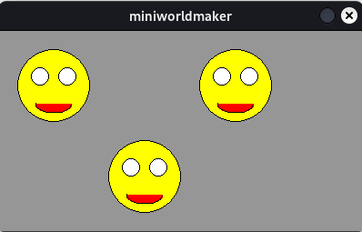
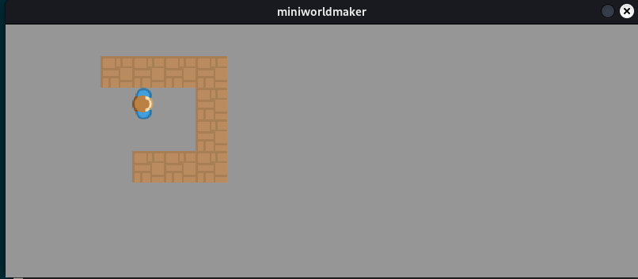

# Konzept: Funktionen

Du hast bisher Methoden verwendet, die zu einem Board oder einem Token gehören, z.B. ``on_setup``, ``act``.

Jetzt lernst du eigene Funktionen zu erstellen. Funktionen sind `Unterprogramme` die dir ermöglichen, Code wiederzuverwenden, 
anstatt ihn immer wieder zu schreiben.

## Erstes Beispiel

du möchtest vier rote Kreise erstellen, so wie im folgenden Bild dargestellt:


Dies geht z.B. so:

``` python
from miniworldmaker import *

board = Board(80, 80)

c1 = Circle((20,20), 20)
c1.color = (255, 0, 0)
c2 = Circle((60,20), 20)
c2.color = (255, 0, 0)
c3 = Circle((60,60), 20)
c3.color = (255, 0, 0)
c4 = Circle((20,60), 20)
c4.color = (255, 0, 0)

board.run()
```


Das Programm ist korrekt. Wenn nun aber alle vier Kreise grün sein sollen, dann musst du das Programm an vier
Stellen verändern.

Stattdessen kann man das Erstellen des Kreises und das festlegen der Farbe in Unterprogramme auslagern:

```python
from miniworldmaker import *

board = Board(80, 80)

def create_circle(x, y):
    c = Circle((x, y), 20)
    c.color = (255, 0, 0)
    
create_circle(20, 20)
create_circle(60, 20)
create_circle(60, 60)
create_circle(20, 60)

board.run()
```

Hier wurde eine Funtion `create_circle` definiert.

* Die Funktion hat den **Namen**  `create_circle`
* Die Funktion erhält als **Übergabeparameter** die Werte `x` und `y` - An dieser Stelle soll der Kreis erstellt werden.
* Im **Methodenkörper** wird zuerst ein Kreis erstellt und diesem anschließend eine Farbe zugewiesen.
* Die Funktion wird mit Hilfe ihres **Namens** und mit Übergabe der **Argumente** (z.B. 20, 20) aufgerufen.

## Allgemein: Definieren von Funktionen

Oft willst du komplizierte Dinge automatisieren, z.B. das Anlegen von Tokens. 

Dies geht, indem du Funktionen selbst definierst - Dies geht im Allgemeinen so:

``` python
def function_name(<parameter>):
    <code_block>
```

z.B.:

``` python
def create_circle(x, y):
    c = Circle((x, y), 20)
    c.color = (255, 0, 0)
```

Deine Funktion besteht aus einer *Signatur* und einem *Funktionskörper*.

* Die Signatur ist die erste Zeile der Funktion. Sie enthält alle Informationen
  die du brauchst um die Funktion aufzurufen. Dies ist der **Name** und **Parameter**.
  Der Name dieser Funktion ist `create_token`, die Parameter sind `x`und `y`. 
  Parameter werden benötigt um der Funktion weitere Informationen zu übergeben. Im Beispiel wird
  die Information übergeben, *wo* das Objekt erstellt werden soll.

* Der Funktionskörper ist ein Code-Block. Er enthält alle Befehle, die bei Aufruf der Funktion 
  nacheinander abgearbeitet werden. Hier wird beim Funktionsaufruf zuerst ein Kreis erzeugt und anschließend 
  werden die Farbe des Kreises festgelegt. 
  
  Die Befehle werden beim Aufruf der Funktion von oben nach unten abgearbeitet.

## Aufruf von Funktionen

Eine Funktion wird mit Hilfe des Namens aufgerufen. Dabei übergibst du der Funktion die 
als Parameter definierten Argumente. 

Allgemein schreibt man:
`method_name(<parameter>)`

Dies kann z.B. so aussehen:

``` python
create_token(4,2)
```

Hier wird ein Token an der Position `x=4` und `y=2` angelegt.

## Komplexe Figuren zeichen

Mit  Hilfe von Funktionen kannst du komplexe Figuren zeichnen:

```python
from miniworldmaker import *

board = Board(400, 220)

def create_face(x, y):
    c = Circle((x, y), 40)
    c.color = (255,255,0)
    c = Circle((x + 15, y - 10), 10)
    c = Circle((x - 15, y - 10), 10)
    a = Arc((x, y + 20), 40, 20, 180, 360)
    a.center = a.position
    a.color = (255, 0, 0)
    
create_face(60, 60)
create_face(260, 60)
create_face(160, 160)

board.run()
```

In der Funktion `create_face` wird ein Gesicht erzeugt. 
Dieses kann anschließend an unterschiedlichen Stellen erzeugt werden.




## Tokens automatisiert erstellen

Mit Hilfe von Funktionen kannst du das erstellen von Tokens abkürzen:

Es werden hier 10 Tokens mit 10 Befehlen angelegt. Ohne Funktionen hättest du 30 Befehle benötigt.

``` python
from miniworldmaker import *

board = TiledBoard()
board.rows = 8

def create_token(x, y):
    t = Token()
    t.position = (x,y)
    t.add_costume("images/player.png")

def create_wall(x, y):
    t = Token()
    t.position = (x,y)
    t.add_costume("images/wall.png")
    
create_token(4,2)
create_wall(4,4)
create_wall(5,4)
create_wall(6,4)
create_wall(6,3)
create_wall(6,2)
create_wall(6,1)
create_wall(5,1)
create_wall(4,1)
create_wall(3,1)

board.run()
```

Ausgabe: 



## Eigenschaften und Methoden registrieren.

Das folgende Programm erstellt automatisch "Regentropfen".

In der funktion raindrop werden nicht nur Eigenschaften für jeden Tropfen festgelegt, sondern auch Methoden registriert.

```python
from miniworldmaker import *
import random

board = Board()
board.add_background((80,180,255))
def raindrop(x,y):
    c = Circle((x, y), random.randint(10, 20))
    speed = random.randint(1,5)
    c.color = (0,0,random.randint(100,255), 100)
    c.static = True
    @c.register
    def act(self):
        self.move_down(random.randint(1,3))
    @c.register
    def on_sensing_not_on_board(self):
        self.remove()
        
@board.register
def act(self):
    if board.frame % 5 == 0:
        raindrop(random.randint(0,400),0)
    

board.run()
```

 <video controls loop width=450px>
  <source src="../_static/raindrops.webm" type="video/webm">
  Your browser does not support the video tag.
</video> 