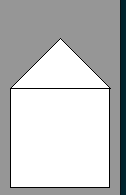
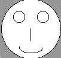

*******************
Training 1
*******************

1. Haus mit Grundformen
#######################

Zeichne ein Haus mit Grundformen:

.. raw:: html

   

   
<a>Lösungsansatz</a>

.. code-block:: python

  from miniworldmaker import *

  board = PixelBoard()
  board.size = (120,210)
  Rectangle((10,100), 100, 100)
  Triangle((10,100), (60, 50), (110, 100))

  board.run()

.. raw:: html

   

2. Gesicht
#######################

Zeichne ein Gesicht mit Grundformen

.. raw:: html

   

   
<a>Lösungsansatz</a>

.. code-block:: python

  from miniworldmaker import *
  import random
  board = PixelBoard((100,100))
  Circle.from_center((50,50),50)
  Arc.from_center((50,80),40,20, 180, 360)
  Circle.from_center((30,30),10)
  Circle.from_center((70,30),10)
  Line((50,50),(50,70))
  board.run()

.. raw:: html

   

