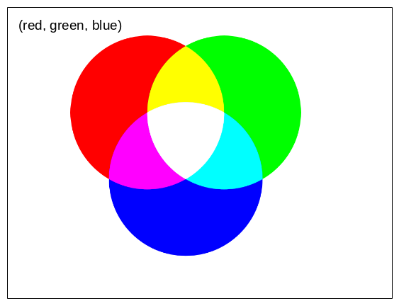

*******************
Farben und Konturen
*******************

Einfärben
#########

Eine geometrische Form kann mit dem Attribut ``fill_color`` eingefärbt werden:

.. code-block:: python
  :lineno-start: 1

  from miniworldmaker import *

  board = PixelBoard(350, 150)
  r = Rectangle((10,10), 100, 100)
  r.fill_color = (255, 0, 0)

  g = Rectangle((120,10), 100, 100)
  g.fill_color = (0, 255,0)

  b = Rectangle((230,10), 100, 100)
  b.fill_color = (0, 0 ,255)

  board.run()

Eine **Farbe** wird als 3-Tupel angegeben:

* Der erste Wert ist der *rot*-Anteil
* Der zweite Wert ist der *grün*-Anteil
* Der dritte Wert ist der *blau*-Anteil

Durch "mischen" dieser Farben erhält man eine konkrete Farbe:

  

Umrandung
#########

Jede geometrische Form kann einen **Rand** haben. 
Den Rand kannst du als Integer-Wert mit dem Attribut ``border`` festlegen und die Farbe mit dem Attribut ``border-radius``:

Das folgende Bild erzeugt ein rotes Rechteck mit gelben Rand:

.. code-block:: python
  :lineno-start: 1

  from miniworldmaker import *

  board = PixelBoard(350, 150)
  r = Rectangle((10,10), 100, 100)
  r.fill_color = (255, 0, 0)
  r.border = 3
  r.border_color = (255, 255,0)

  board.run()

Ausgabe:

  .. image:: ../_images/processing/border.png
    :width: 80%  
    :alt: rgb colors

Füllung
#######

Du kannst auch Figuren zeigen, die nur einen Rand aber über keine Füllung besitzen. Das Attribut ``fill`` legt fest, ob ein Objekt eine Füllung hat.

Das folgende Rechteck hat z.B. keine Füllung:

.. code-block:: python
  :lineno-start: 1

  from miniworldmaker import *

  board = PixelBoard(350, 150)
  r = Rectangle((10,10), 100, 100)
  r.fill = False
  r.border = 3
  r.border_color = (255, 255,0)

  board.run()

Das Board
#########

Alle Figuren werden auf einem ``Board`` gezeichnet. Auch das Board hat verschiedene Eigenschaften, die verändert werden können, z.B. Größe und Hintergrundfarbe.

Bachte folgenden Code:

.. code-block:: python
  :lineno-start: 1

  from miniworldmaker import *

  board = PixelBoard()
  board.add_background((255,255,255))
  board.size = (400,200)
  r = Rectangle((10,10), 100, 100)
  r.fill = False
  r.border = 3
  r.border_color = (255, 255,0)

  board.run()

Ausgabe:

  .. image:: ../_images/processing/board.png
    :width: 80%  
    :alt: board

