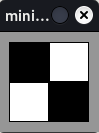
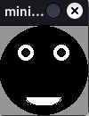

*******************
Training 2
*******************

1. Black and White
#######################

Zeichne folgende Form

.. raw:: html

   

   
<a>Lösungsansatz</a>

.. code-block:: python

  from miniworldmaker import *
  import random
  board = PixelBoard((100,100))
  a = Rectangle((10,10),40,40)
  a.fill_color = (0,0,0)
  b = Rectangle((50,10),40,40)
  b.fill_color = (255, 255, 255)
  c = Rectangle((10,50),40,40)
  c.fill_color = (255, 255, 255)
  d = Rectangle((50,50),40,40)
  d.fill_color = (0, 0, 0)
  board.run()

.. raw:: html

   

1. Black Face
#######################

Zeichne folgende Form

.. raw:: html

   

   
<a>Lösungsansatz</a>

.. code-block:: python

  from miniworldmaker import *
  import random
  board = PixelBoard((100,100))
  bg = Circle.from_center((50,50),50)
  bg.fill_color = (0,0,0)
  Arc.from_center((50,80),40,20, 180, 360)
  Circle.from_center((30,30),10)
  Circle.from_center((70,30),10)

  c = Circle.from_center((70,30),5)
  d = Circle.from_center((30,30),5)
  c.fill_color = (0, 0, 0)
  d.fill_color = (0, 0, 0)
  Line((50,50),(50,70))
  board.run()

.. raw:: html

   

