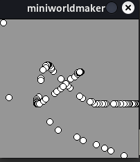
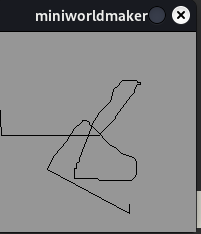
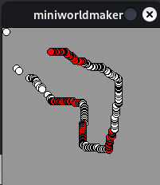

*******************
Interaktion
*******************

on_setup und act
#################

Bisher hast du Befehle einfach untereinander geschrieben und die Befehle wurden dann von oben nach unten abgearbeitet.

Wenn du ein interaktives Programm schreiben willst, dann musst du dies etwas durchbrechen.

Dazu kannst du Methoden **registrieren**, die zu bestimmten Zeiten aufgerufen werden oder auf bestimmte Ereignisse reagieren.

Wir fangen mit zwei einfachen Methoden an, ``on_setup`` und ``act``

* ``on_setup`` wird einmal aufgerufen, wenn das ``Board`` erstellt wurde.

* ``act`` wird immer und immer wieder aufgerufen, einmal pro Zeiteinheit.

Das folgende Programm:

.. code-block:: python

  from miniworldmaker import *

  board = PixelBoard()
  board.size = (120,210)

  @board.register
  def on_setup(self):
      print("setup")
    
  @board.register
  def act(self):
      print("act")

liefert z.B. folgende Ausgabe

.. code-block::

    setup
    act
    act
    act
    ...

Code-Blöcke
***********

Die Zeile ``def on_setup(self):`` endet mit einem Doppelpunkt. Darunter siehst du einen Codeblock:

Die Inhalte der Funktion sind alle *eingerückt*, alles was gleich weit eingerückt ist, gehört zu einem Block.

.. code-block:: python

  from miniworldmaker import *

  board = PixelBoard()
  board.size = (120,210)

  @board.register
  def on_setup(self):
      print("Dies ")
      print("ist ")
      print("Teil ")
      print("eines Codeblocks ")
  print("Dies aber nicht")

Beim Aufruf von ``on_setup`` werden die vier Zeilen darunter aufgerufen, nicht aber die 5. Zeile.

.. note::
  In der Regel verwendet man in Python *4 Leerzeichen*, wenn man einen Codeblock einrückt.
  Es ist zwar kein Fehler, wenn du nur 3,2,1 oder 5 Leerzeichen oder ein Tab verwendest, solange du immer gleich 
  weit einrückst - Dies wird von erfahrenen Programmierern aber als schlecher Stil empfunden.

Frame Rate - Wie oft wird act() aufgerufen
###########################################

Man kann einstellen, wie oft ``act()`` aufgerufen wird, indem man die Attribute ``board.fps`` und ``board.speed`` konfiguriert.

* ``board.fps`` definiert die ``frame rate``. Analog zu einem Daumenkino, bei dem du mit festgelegter Geschwindigkeit die Seiten umblätterst, 
  definiert die Framerate wie oft pro Sekunde das Bild neu gezeichnet wird.
  ``board.fps`` hat den Standardwert 60, d.h. es werden 60 Bilder pro Sekunde angezeigt.
* Im Attribut ``board.frame`` wird der aktuelle frame gespeichert. Die Frames seit Programmstart werden hochgezählt.
* ``board.speed`` definiert wie oft die Programmlogik (z.B. act) pro Sekunde aufgerufen wird. 
  Ein Wert von 60 bedeutet, dass die act()-Methode jeden 60. Frame aufgerufen wird.

.. code-block:: python

  from miniworldmaker import *

  board = PixelBoard()
  board.size = (120,210)

  @board.register
  def on_setup(self):
      board.fps = 1
      board.speed = 3
      
  @board.register
  def act(self):
      print(board.frame)

  board.run()

Das Programm oben hat die Ausgabe:

.. code-block::

  3
  6
  9
  12
  15

Es wird sehr langsam hochgezählt, weil genau ein Frame pro Sekunde abgespielt wird und jeden 3. Frame
(also alle 3 Sekunden) die Funktion ``act()`` aufgerufen wird.

.. warning::
  Achtung: Es kann zu unvorhergesehenen Nebenwirkungen führen, wenn man Code falsch einrückt, betrachte z.B. folgendes Programm:

  .. code-block:: python

    from miniworldmaker import *

    board = PixelBoard()
    board.size = (120,210)

    @board.register
    def on_setup(self):
        print(1)

    print(2)

    @board.register
    def act(self):
        print(3)
    print(4)
  
    board.run()  

  Das Programm hat die Ausgabe:

  .. code-block::
  
    1
    2
    4
    1
    3
    3
    ...

  Dies liegt daran, dass zuerst ``on_setup()`` ausgeführt wird, nachdem in Zeile 3 das Board erstellt wurde.
  Anschließend werden die beiden nicht eingerückten Befehle ausgeführt und sobald ``run()`` gestartet wird, wird die Funktion
  ``act()`` aufgerufen. Achte darauf, dass deine Anweisungen sich innerhalb der Code-Blöcke von act und on_setup befinden.

Maus-Interaktionen 
##################

Interaktionen finden im miniworldmaker über **Events** statt. Events können durch unterschiedlichste Systemereignisse aufgerufen werden,
z.B. wenn der Benutzer eine Eingabe mit der Tastatur oder mit der Maus getätigt hat.

Zunächst schauen wir uns Mausinteraktionen an:

Mit der Methode ``get_mouse_position`` kannst du die Mausposition abfragen:

.. code-block:: python

  from miniworldmaker import *

  board = PixelBoard()

  @board.register
  def on_setup(self):
      board.size = (200,200)

  @board.register
  def act(self):
      Ellipse(board.get_mouse_position(), 10, 10) 

  board.run()

Der Kreis folgt nun deiner Mausposition:

Wenn du Linien zeichnen möchtest, benötigst du die aktuelle und die letzte Mausposition. Dies geht z.B. wie folgt:

.. code-block:: python

  from miniworldmaker import *

  board = PixelBoard()

  @board.register
  def on_setup(self):
      board.size = (200,200)

  @board.register
  def act(self):
      Line(board.get_prev_mouse_position(), board.get_mouse_position()) 

  board.run()

Listener-Methoden
#################

Schön wäre es, wenn wir noch auf spezifische Events reagieren können, z.B. auf Tastendrücke oder Mausklicks. 
Dafür können wir bestimmte Listener-Methoden registrieren, z.B. ``on_mouse_pressed``

.. code-block:: python

  from miniworldmaker import *

  board = PixelBoard()

  @board.register
  def on_setup(self):
      board.size = (200,200)

  @board.register
  def act(self):
      Ellipse(board.get_mouse_position(), 10, 10) 

  @board.register
  def on_mouse_left(self, position):
      board.fill_color = (255, 0, 0)
    
  @board.register
  def on_mouse_right(self, position):
      board.fill_color = (255, 255, 255)
    
  board.run()

