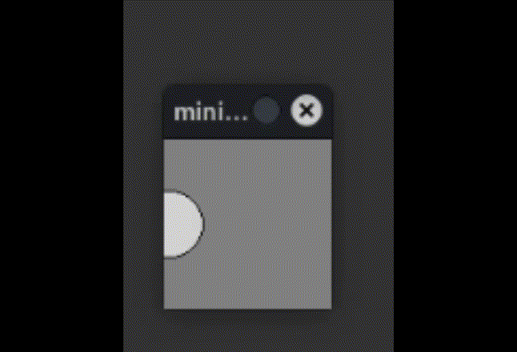
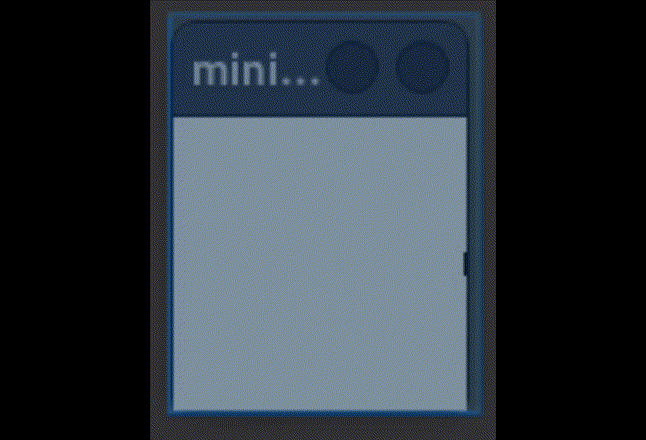

# Bewegung

In diesem Kapitel setzen wir Elemente in Bewegung. Dabei helfen uns auch Variablen.

## Einfache Bewegungen

Eine einfache Bewegung kannst du realisieren, indem du bei einem Objekt die Attribute x und y veränderst.

``` python
from miniworldmaker import *
import random
board = Board((100,100))
c = Circle((0,50), 20)
@board.register
def act(self):
    c.x = c.x + 1
    
board.run()
```
Ausgabe:



## Der Modulo-Operator

Für sich wiederholende Bewegungen ist der Modulo-Operator besonders hilfreich. 

Python kennt 3 Arten von Divisionen:

13 / 3 liefert das Ergebnis 4.3333333333
13 // 3 liefert das **ganzzzahlige** Ergebnis 4
13 % 3 liefert den Rest der Division 13 / 3, also 1 zurück.

Das der Rest niemals größer als der Dividend sein kann, kann uns bei Animationen helfen:

``` python
from miniworldmaker import *
import random
board = Board((100,100))
c = Circle((0,50), 20)
x = 0
@board.register
def act(self):
    global x
    c.x = x % 100
    x = x + 1
board.run()
```

Die Variable x zählt immer weiter nach oben, da der Rest der Division von x und 100 niemals größer als 100 werden kann, wandert der Punkt wieder zurück.

