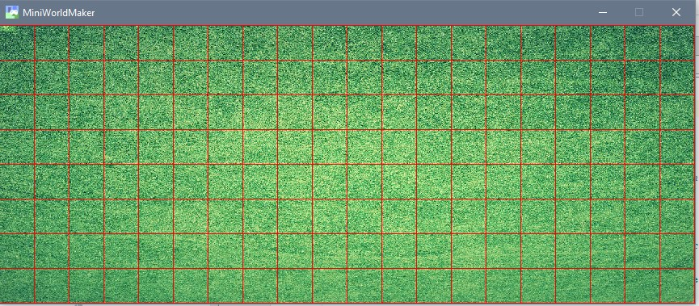

Erste Schritte
==============

Los geht es!

MiniWorldMaker ist eine Engine, die dir erlaubt, eigene Miniwelten und Spiele zu erschaffen.

In den folgenden Schritten wird dir gezeigt, wie du eigene Miniwelten erstellst und Akteure in den Welten erschaffst.

Eine erste Welt
===============

Wir erschaffen die erste Welt. Dies geht mit folgendem Code:

```
from miniworldmaker import *

class MyBoard(TiledBoard):

    def __init__(self):
        super().__init__(columns=20, rows=8, tile_size=42, tile_margin=1)
        self.add_image(path="images/soccer_green.jpg")
        
board = MyBoard()
board.show()
```

Zunächst wird eine eigene *Klasse* MyBoard erstellt. Diese ist eine Kindklasse von TiledBoard 
und erlaubt es dir, alle möglichen Spiele zu bauen, die auf Tiles basieren.

  * Zeile 1: Mit der **import** Anweisung wird die Bibliothek miniworldmaker importiert. 
  * Zeile 3: Das eigene Spielfeld wird als Kindklasse der Klasse Tiledboard erstellt.
  * Zeile 5-6: Die __init__() - Methode wird bei Erstellen eines neuen Objektes aufgerufen (d.h. hier in Zeile 7). 
  Am Anfang der __init__() - Methode wird zunächst mit super().__init__() die Methode der Vaterklasse aufgerufen, 
  welche die Größe des Spielfeldes und der einzelnen Kacheln festlegt.
  * Zeile 7: Deinem Board wird ein Hintergrund hinzugefügt. Achte darauf, dass die Datei an dem angegebenen Pfad liegt.  

Je nach Hintergrundbild sieht das Ergebnis bei dir so aus:


### Das Grid anzeigen
Wenn du möchtest kannst du dir auch die Grenzen der einzelnen Tiles anzeigen lassen. 
Ändere dazu die Methode __init__() in der Klasse MyBoard ab:

```
    def __init__(self):
        super().__init__(columns=20, rows=8, tile_size=42, tile_margin=1)
        self.show_grid()
        self.add_image(path="images/soccer_green.jpg")
```

So sieht es dann aus:



Einen Akteur erstellen
======================

Als nächtes wird ein Akteur auf dem Board platziert. 

Dies geht prinzipiell ähnlich wie das Erstellen des Spielfeldes:


```
class Player(Actor):

    def __init__(self):
        super().__init__()
        self.add_image(path="images/char_blue.png")
```

  * Die erste Zeile erstellt eine neue Klasse als Kindklasse der Klasse Actor.
  * In der dritten Zeile wird wieder die __init__()-Methode erstellt, die beim Erstellen eines neuen Player-Objektes aufgerufen wird.
  * Zeile 4 ruft die init()-Methode der Vaterklasse auf, die zahlreiche Dinge hinter den Kulissen initialisiert.
  * In Zeile 5 wird dann zu dem Player-Objekt ein Bild hinzugefügt.
  
  Den Akteur zum Spielfeld hinzufügen
  ===================================
  
  Bis jetzt haben wir nur eine Schablone erstellt, um Player-Objekte zu erzeugen.
  Jetzt sollen konkrete Objekte erzeugt und zum Spielfeld hinzugefügt werden.
    Ergänze dazu die __init__() - Methode der Spielfeld-Klasse:
  
```  
    def __init__(self):
        super().__init__(columns=20, rows=8, tile_size=42, tile_margin=1)
        player1 = Player( )
        self.add_actor(player1, position=(3, 3))
```

  * Zeile 3 erstellt das Player Objekt (und ruft die init()-Methode auf.
  * Zeile 4 fügt das erstellte Objekt dem Spielfeld hinzu, damit die Figur nicht im "Niemandsland" lebt.