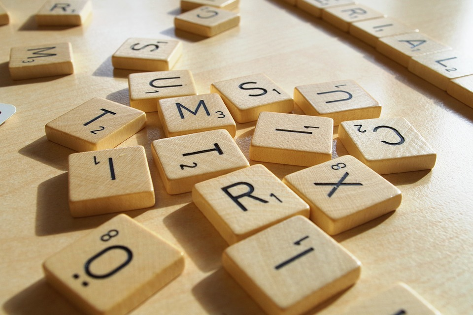

Erste Schritte
==============

Los geht es!

MiniWorldMaker ist eine Engine, die dir erlaubt, eigene Miniwelten und Spiele zu erschaffen.

In den folgenden Schritten wird dir gezeigt, wie du eigene Miniwelten erstellst und Akteure in den Welten erschaffst.

Eine erste Welt
===============

Wir erschaffen die erste Welt. Dies geht mit folgendem Code:

```
from miniworldmaker import *

class MyBoard(TiledBoard):

    def __init__(self):
        super().__init__(columns=20, rows=8, tile_size=42, tile_margin=1)
        self.add_image(path="images/soccer_green.jpg")
        
board = MyBoard()
board.show()
```

Zunächst wird eine eigene *Klasse* MyBoard erstellt. Diese ist eine Kindklasse von TiledBoard 
und erlaubt es dir, alle möglichen Spiele zu bauen, die auf Tiles basieren.

Tiles sind Kacheln mit fester Größe wie du sie oft in Brettspielen verwendest. 

 

Wenn du möchtest kannst du dir auch die Grenzen der einzelnen Tiles anzeigen lassen. 
Ändere dazu die Methode __init__() in der Klasse MyBoard ab:
```
    def __init__(self):
        super().__init__(columns=20, rows=8, tile_size=42, tile_margin=1)
        self.show_grid()
        self.add_image(path="images/soccer_green.jpg")
```

So sieht es dann aus:


Als nächtes wird ein Akteur auf dem Board platziert. 